# Schedule {.scrollable .smaller}


<figure>
  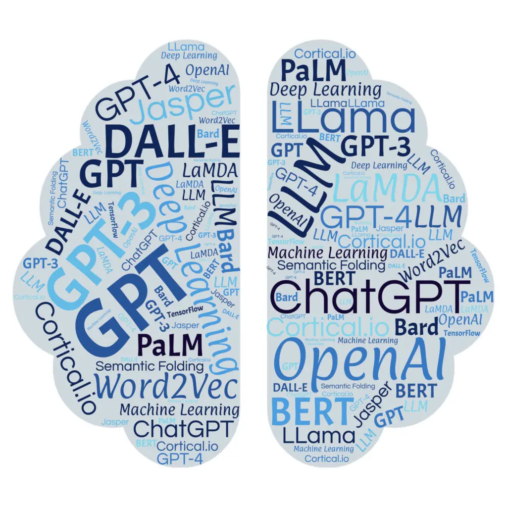
<br>


- **Introduction to Large Language Models** (50 minutes)
  + What is a language model?
  + From word embeddings to transformers
  + Pre-trained models (BERT, GPT, frontier models)
  + Applications in the social sciences

**10 minute break**

- **Project 1: Training & Validating a Small Model** (60 minutes)
  + Fine-tune BERT for text classification
  + Validation: accuracy, precision, recall, F1

**1 hour lunch**

- **Project 2: Structured Data Extraction with a Large Model API** (60 minutes)
  + Zero-shot prompting via the OpenAI API
  + Structured (JSON) output and validation

**10 minute break**

- **Project 3: Analysing Images with a Vision Model** (40 minutes)
  + Multimodal LLMs and visual content analysis
  + Coding political images with GPT-4o

**Wrap-up & Discussion** (10 minutes)

</figure>


# My Background & Research Interests


# What are Large Language Models (LLMs)?

- A language model is a machine learning model that intends to predict the next word in a sentence given the previous words.
  - Example: Autocomplete on your phone

- These models work by estimating the probability of a token (e.g. word), or a sequence of tokens, given the context of the sentence.
  - Example: "The cat is on the ___"
    + cup: 2.3%
    + mat: 8.9%
    + computer: 1.2%
    + coffee: 0.9%
  - The model predicts the next word is "mat" with the highest probability.
  - A sequence of tokens could be a sentence, paragraph, or entire document.


::: footer
Introduction to Large Language Models
:::


# What are Large Language Models (LLMs)?

- Modeling human language is very complex
  - Syntax, semantics, pragmatics, etc.
  - Context, ambiguity, and nuance
  - Cultural and social norms

- As models get larger, they can capture more of these complexities
  - More parameters, more data, more context
  - Better at predicting the next word in a sentence
  - Better at understanding the meaning of words and sentences


# Transformers

<figure>
  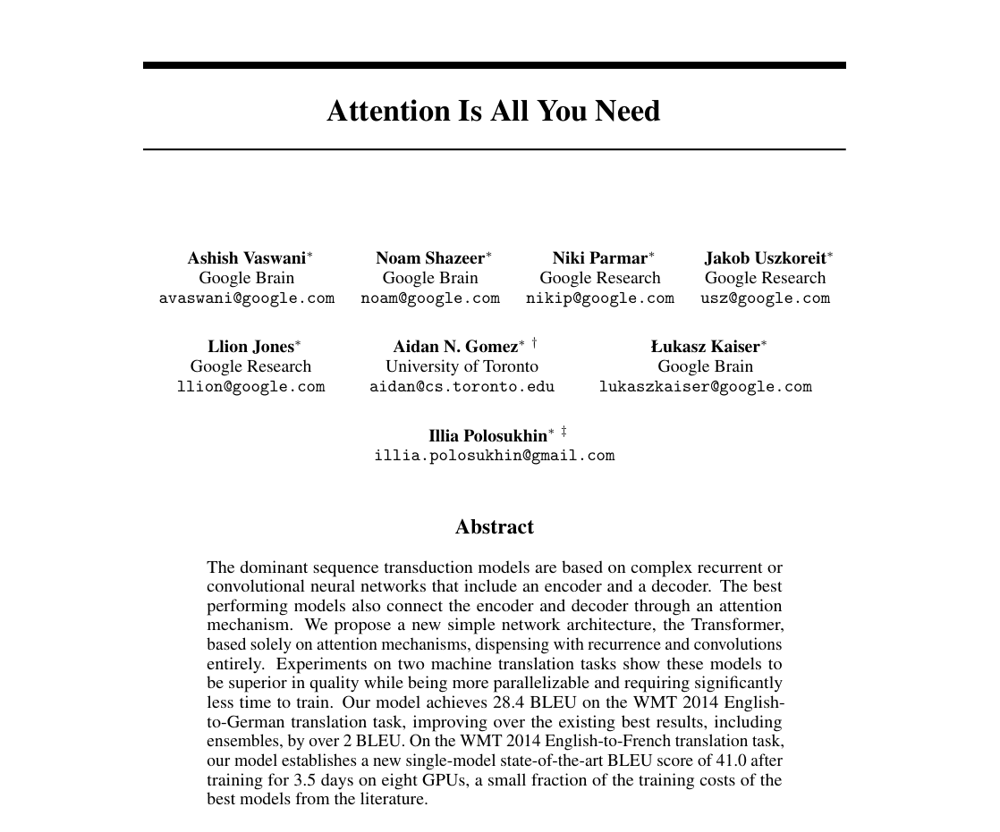
</figure>


# Transformers


- Transformers are a type of neural network architecture that has revolutionized natural language processing (NLP).
  - Introduced by [Vaswani et al. (2017)](https://scholar.google.com/scholar?hl=en&as_sdt=0%2C5&q=attention+is+all+you+need&btnG=&oq=attention+i)
  - The model is based on the concept of "attention"

- Transformers consist of an encoder and a decoder
  - The encoder processes the input sequence and produces a sequence of hidden states
  - The decoder takes the hidden states produced by the encoder and generates the output sequence


# Transformers Architecture


<figure>
  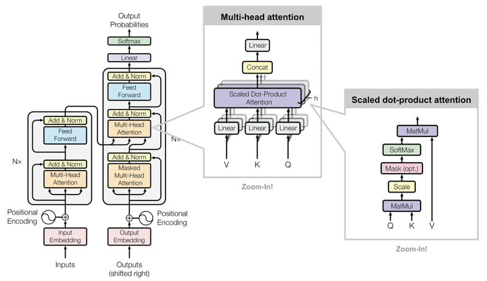
</figure>


# Attention Mechanism


- Attention is a mechanism that allows the model to focus on different parts of the input sequence when making predictions.
  - The model can learn which parts of the input are most important for making predictions.
  - This allows the model to capture long-range dependencies in the data.
  - The model can also learn to focus on different parts of the input depending on the context of the sentence.


# Attention Mechanism


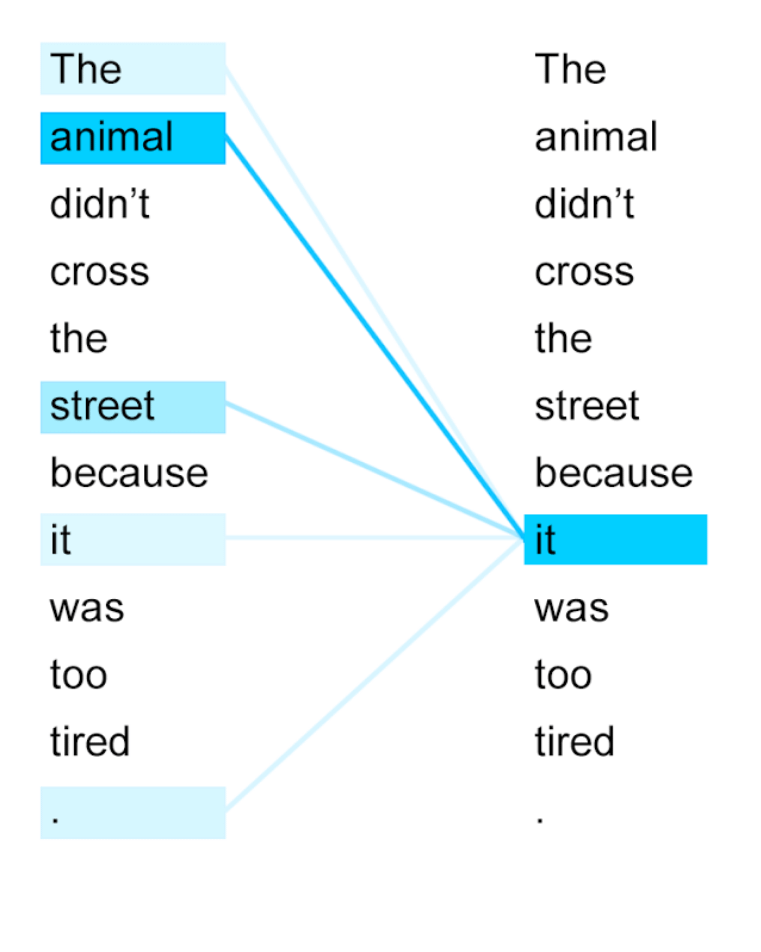


# How do LLMs generate text?

- LLMs generate text by sampling from the probability distribution over the vocabulary at each time step.
  - The model predicts the next word in the sequence by sampling from the distribution over the vocabulary.
  - The model can generate text one word at a time, or it can generate multiple words at once.
  - The model can also generate text conditioned on a specific input, such as a prompt or a context.
  - The model can generate text that is coherent and grammatically correct, but it can also generate text that is nonsensical or incoherent.

- **Example:**
  - "My dog, Max, knows how to perform many traditional dog tricks. _______"
    - 2.3%: "For example, he can sit, stay, and roll over."
    - 2.1%: "He can also fetch a ball, and he loves to play with his toys."


# Pre-trained Models

- Pre-trained models are large language models that have been trained on a large amount of text data
  - Trained on a large corpus of [text data](https://huggingface.co/datasets), such as Wikipedia, news articles, and books
  - Unsupervised learning, which means it does not require labeled data
  - Trained for a long time, often several days or weeks

- Pre-trained models can be fine-tuned on a specific task or dataset
  - Fine-tuning involves updating the parameters of the pre-trained model on a [smaller dataset](https://huggingface.co/datasets/open-r1/OpenR1-Math-220k) that is specific to the task
  - Fine-tuning allows the model to learn the specific patterns and relationships in the data


# Pre-trained Models

- Pre-trained models example: [BERT](https://huggingface.co/google-bert/bert-base-uncased) (Bi-directional Encoder Representations from Transformers)
  - Introduced by [Devlin et al. (2018)](https://arxiv.org/abs/1810.04805)
  - Pre-trained on a large corpus of text data, such as Wikipedia and news articles
  - Fine-tuned on specific tasks, such as question answering, text classification, and named entity recognition


# BERT Example

```{.python}
from transformers import pipeline
unmasker = pipeline('fill-mask', model='bert-base-uncased')
unmasker("Hello I'm a [MASK] model.")

[{'sequence': "[CLS] hello i'm a fashion model. [SEP]",
  'score': 0.1073106899857521,
  'token': 4827,
  'token_str': 'fashion'},
 {'sequence': "[CLS] hello i'm a role model. [SEP]",
  'score': 0.08774490654468536,
  'token': 2535,
  'token_str': 'role'},
 {'sequence': "[CLS] hello i'm a new model. [SEP]",
  'score': 0.05338378623127937,
  'token': 2047,
  'token_str': 'new'},
 {'sequence': "[CLS] hello i'm a super model. [SEP]",
  'score': 0.04667217284440994,
  'token': 3565,
  'token_str': 'super'},
 {'sequence': "[CLS] hello i'm a fine model. [SEP]",
  'score': 0.027095865458250046,
  'token': 2986,
  'token_str': 'fine'}]
```

# The Landscape of Modern LLMs

- **Encoder models** (e.g. BERT, RoBERTa)
  - Read text in both directions simultaneously
  - Best for: classification, information extraction, embeddings

- **Decoder models** (e.g. GPT, LLaMA, DeepSeek)
  - Generate text left-to-right, one token at a time
  - Best for: text generation, summarisation, question answering

- **Frontier models** (e.g. GPT-4o, Claude, Gemini)
  - Very large, instruction-tuned, often multimodal
  - Accessed via API rather than run locally
  - Best for: complex reasoning, structured tasks, images

- **Open vs. closed models**
  - Open (HuggingFace, Ollama): reproducible, free, run locally
  - Closed (OpenAI, Anthropic): more capable, but cost per token and privacy implications


# A Framework for Applications

- **Regression**
  - Predicting a continuous variable (e.g. stock prices, house prices, ideology scores)
- **Classification**
  - Predicting a categorical variable (e.g. sentiment, topic, party affiliation)
- **Clustering**
  - Grouping similar data points together (e.g. customer segmentation, topic modelling)
- **Generation & Extraction**
  - Generating text or extracting structured information from unstructured text


# Fine-tuning vs. Prompting {.smaller}

Two ways to apply a pre-trained model to your research task:

|  | **Fine-tuning** | **Prompting** |
|--|-----------------|---------------|
| Training data needed | Yes (labelled examples) | No |
| Model runs | Locally | Via API (cloud) |
| Cost | One-off compute | Pay per token |
| Speed (inference) | Fast | Slower |
| Reproducibility | High | Medium (version APIs) |
| Task complexity | Single, well-defined | Complex, multi-step |
| Today's project | **Project 1** | **Projects 2 & 3** |


# Let's take a break


---

# Project 1 {.center}

## Training & Validating a Small Model


# Project 1: Text Classification

- We fine-tune **BERT** (`bert-base-cased`) on the BBC News corpus
  - 2,225 labelled articles across five categories: Business, Entertainment, Politics, Sport, Tech
  - The same pipeline applies to any supervised classification task

- **What happens during fine-tuning?**
  - We load BERT's pre-trained weights (general language understanding)
  - We add a classification head: a small linear layer mapping BERT's output to 5 categories
  - We train for a few epochs — the model adapts its weights to our specific task

- **Why is this useful for social science?**
  - Apply the trained model to thousands of unlabelled documents
  - Consistent, scalable coding at a fraction of the manual cost
  - Works for: issue coding, sentiment, framing, ideology, event detection


# Validation is Crucial

- A model that appears to perform well on training data may fail on new data — this is called **overfitting**

- We always evaluate on a **held-out test set**: data the model never saw during training
  - Typically 10–20% of the labelled data
  - Must be set aside *before* any training begins

- **Validation strategies**
  - Train/test split (we use this today)
  - k-fold cross-validation (more robust, but slower)
  - Domain validation: testing on data from a different source or time period


# Model Evaluation Metrics

- **Accuracy**
  - The proportion of correct predictions out of the total number of predictions
- **Precision**
  - Of all articles *predicted* as category X, what fraction actually are X?
- **Recall**
  - Of all *true* category X articles, what fraction did the model correctly identify?

- **F1 Score**
  - The harmonic mean of precision and recall
  - F1 = 2 * (precision * recall) / (precision + recall)
  - Preferred when class sizes differ

# Confusion Matrix

- A confusion matrix is a table that is often used to describe the performance of a classification model on a set of test data for which the true values are known.

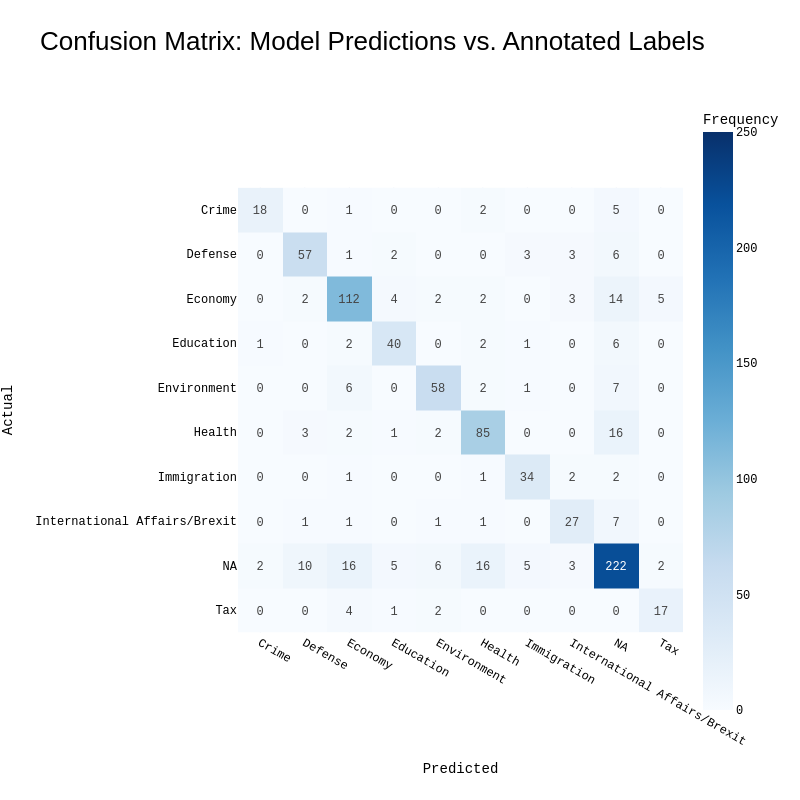


# Notebook 1 {.center}

**Open `code/bbc_news_cats.ipynb`**

Project 1: Fine-tuning BERT for Text Classification

<figure>
  
</figure>


---

# 🍽️ Lunch Break {.center}

*Back at 13:00*

---

# Project 2 {.center}

## Structured Data Extraction with a Large Model API


# Project 2: From Training to Prompting

- In Project 1 we *trained* a model — we needed labelled data and a GPU

- In Project 2 we *prompt* a model — we describe the task in plain language and send it to a remote API

- **Zero-shot prompting**: the model performs a task it has never been specifically trained on, using knowledge from pre-training
  - No labelled data required
  - Works immediately — just write good instructions

- **Why is this powerful for social scientists?**
  - Pilot studies and exploratory coding without annotation effort
  - Complex, multi-field extraction in a single call
  - Tasks that are hard to define with fixed labels in advance


# Prompt Engineering

- A **prompt** is the instruction we send to the model. Writing effective prompts is a skill.

- **System message**: persistent background instructions (who the model is, what format to use)

- **User message**: the specific input to process (e.g. the document to extract from)

- Key principles for structured extraction:
  - Define the **output schema** explicitly (field names, allowed values)
  - Use **JSON output** so results are machine-parseable
  - Specify edge cases and defaults
  - Test on a small sample before running at scale

```python
messages = [
  {"role": "system", "content": "You are an expert in UK legislation.
   Return a JSON object with fields: policy_area, affected_group,
   geographic_scope, bill_summary."},
  {"role": "user",   "content": "Bill title: Cycle Tracks Bill 1985/86"}
]
```


# Project 2: The Extraction Task

- **Dataset**: Successful UK House of Commons Private Members' Bills (1983–present)
  - 404 bills, each with a title like: *"Taxis and Private Hire Vehicles (Safeguarding and Road Safety) Bill 2021-22"*

- **Task**: Extract four structured fields from each bill title

  | Field | Example |
  |-------|---------|
  | `policy_area` | Transport |
  | `affected_group` | taxi drivers, passengers |
  | `geographic_scope` | UK-wide |
  | `bill_summary` | Requires safeguarding checks for taxi drivers |

- **Validation**: compare a sample of API extractions to hand-coded labels


# Notebook 2 {.center}

**Open `code/api_extraction.ipynb`**

Project 2: Structured Data Extraction with the OpenAI API

<figure>
  
</figure>


---

# ☕ Short Break {.center}

*Back in 10 minutes*

---

# Project 3 {.center}

## Analysing Images with a Vision Language Model


# Project 3: Vision Language Models

- **Multimodal LLMs** can process both text *and* images as input
  - GPT-4o, Claude, and Gemini all support image inputs
  - Images are encoded by a **vision encoder** into embeddings fused with text

- **What can they do with images?**
  - Describe image content in natural language
  - Answer factual questions about what is depicted
  - Count people, read visible text (OCR), identify objects and settings
  - Reason about context, relationships, and meaning

- **Two ways to send images**
  - **URL**: point to a publicly accessible image online
  - **Base64**: embed a local file directly in the API request


# Project 3: Visual Content Analysis in Social Science

Visual data is increasingly central to social science research — but has been hard to analyse at scale

- **Political protests**: who protests, how, where, with what demands?
- **Political advertising**: visual framing, emotional appeals, targeting
- **Social media imagery**: meme spread, visual discourse, disinformation
- **Archival photographs**: historical documentation, newspaper front pages
- **Parliamentary records**: chamber composition, seating, symbolic objects

Vision LLMs let us apply a **structured coding scheme** to images in the same way we prompt for text extraction in Project 2 — describe your categories in the system message, receive coded JSON output


# Project 3: Our Coding Scheme

We code eight dimensions of political protest photographs:

| Dimension | Example values |
|-----------|----------------|
| `setting` | outdoor public space, street march, parliament |
| `crowd_size` | individual, small group, large crowd |
| `visible_signage` | yes / no / unclear |
| `primary_theme` | environment, racial justice, gender rights, ... |
| `emotional_tone` | angry, hopeful, solemn, determined |
| `actors_visible` | protesters, police, politicians, media |
| `image_type` | march, rally, vigil, direct action |
| `confidence` | high / medium / low |

Adapted from the visual framing literature (Koenig 2006; Rodriguez & Dimitrova 2011)


# Notebook 3 {.center}

**Open `code/vision_analysis.ipynb`**

Project 3: Analysing Political Images with GPT-4o Vision

<figure>
  
</figure>


---

# Wrap-up & Broader Context {.center}


# Advanced Applications in the Social Sciences


# Identifying Instrumental Variables

[Mining causality: AI-assisted search for instrumental variables. Han (2024)](https://arxiv.org/abs/2409.14202)


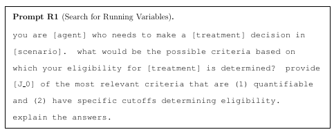


# Predicting Conflict Intensity

Introducing an Interpretable Deep Learning Approach to Domain-Specific Dictionary Creation: A Use Case for Conflict Prediction [Häffner et al. (2023)](https://doi.org/10.1017/pan.2023.7)


*We train the neural networks on a corpus of conflict reports and match them with conflict event data. This corpus consists of over 14,000 expert-written International Crisis Group (ICG) CrisisWatch reports between 2003 and 2021*


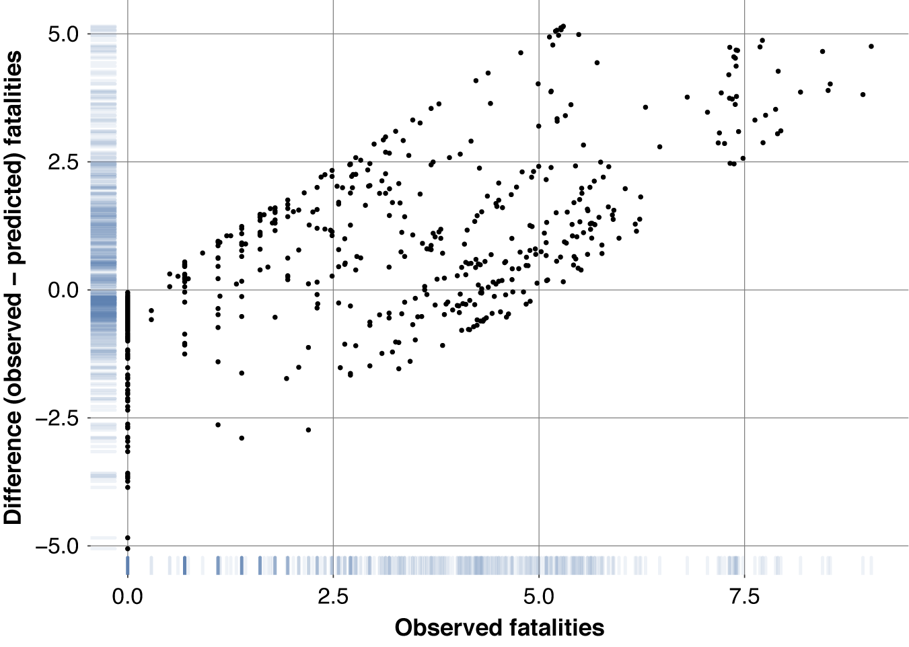


# Microtargeting and Political Persuasion


Evaluating the persuasive influence of political microtargeting with large language models [Hackenburg & Margetts (2024)](https://www.pnas.org/doi/abs/10.1073/pnas.2403116121)

*[...] we integrate user data into GPT-4 prompts in real-time, facilitating the live creation of messages tailored to persuade individual users on political issues. We then deploy this application at scale to test whether personalized, microtargeted messaging offers a persuasive advantage compared to nontargeted messaging.*


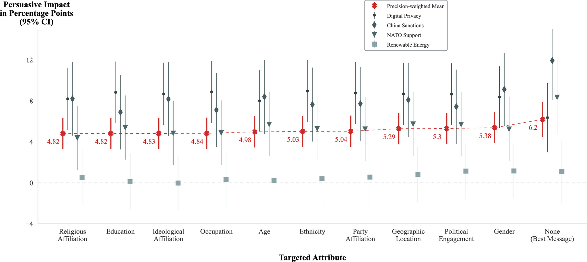


# Synthetic Data Generation

Synthetically generated text for supervised text analysis [Halterman (2025)](https://doi.org/10.1017/pan.2024.31)

*This article proposes using LLMs to generate synthetic training data for training smaller, traditional supervised text models.*

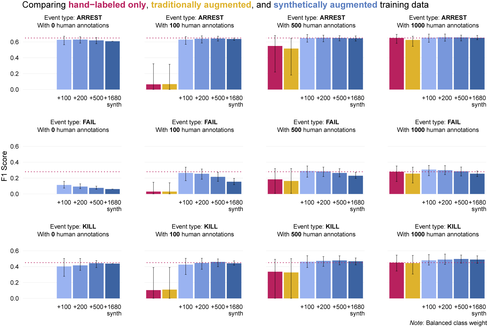


# Scaling Political Texts

Positioning Political Texts with Large Language Models by Asking and Averaging [Le Mens & Gallego (2025)](https://doi.org/10.1017/pan.2024.29)

*We ask an LLM where a tweet or a sentence of a political text stands on the focal dimension and take the average of the LLM responses to position political actors such as US Senators, or longer texts such as UK party manifestos or EU policy speeches given in 10 different languages.*


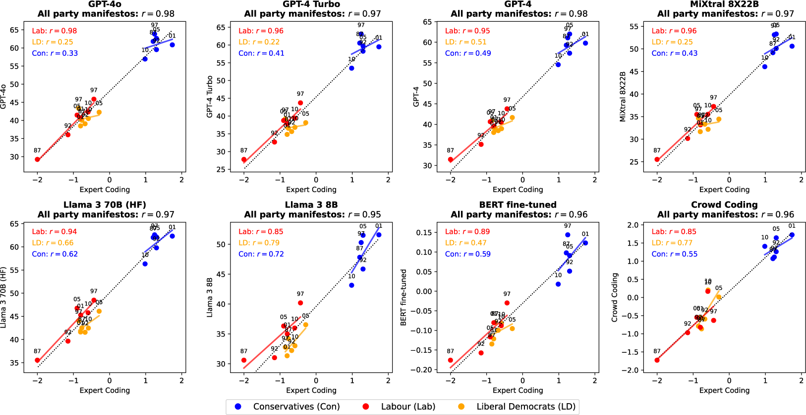


# Limitations & Ethical Considerations

<br>

**Not a panacea**


# Ethical Considerations in LLMs

- **Data Bias**
  - Models can learn biases present in the training data
  - Biases can be harmful and perpetuate stereotypes
- **Data Privacy**
  - Models can memorize sensitive information present in the training data
  - Do not send confidential or personally identifiable data to commercial APIs
- **Environmental Impact**
  - Training large language models requires a lot of computational resources
  - This can have a significant environmental impact
- **Dual-use**
  - Methods developed for research can be repurposed for surveillance, manipulation, or disinformation


# Limitations

- Synthetic survey data generation: [Bisbee et al. (2023)](https://osf.io/preprints/socarxiv/5ecfa), [Sanders et al. (2023)](https://arxiv.org/abs/2307.04781) and [Simmons & Hare (2023)](https://arxiv.org/abs/2310.17888)
  - A word of caution (see [Bisbee et al. (2023)](https://osf.io/preprints/socarxiv/5ecfa))

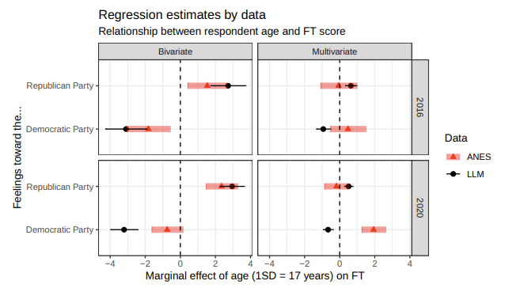


# Replication

- **Replication**
  - Replicating the results of a study is crucial for ensuring the validity and reliability of the findings
  - Replication involves re-running the analysis using the same data and methods as the original study


# Replication & Reproducibility

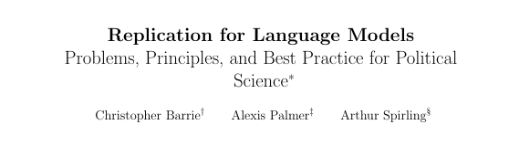


# Replication & Reproducibility

- Take replication seriously — impose standards on ourselves and others
- Opt for open-source models or pin versions of proprietary models
- Think carefully about reducing variance (set `temperature=0`, log your prompts)
- Always report: model name, model version, prompt text, date of analysis


# Future Directions

- **Agentic systems**
  - LLMs that plan, use tools, and complete multi-step tasks autonomously
  - Applications: automated literature review, data collection pipelines

- **Multimodal research** (beyond what we covered today)
  - Audio and video analysis (speeches, interviews, political advertising)
  - Cross-modal reasoning: image + caption + article together

- **Open-source models closing the gap**
  - LLaMA 3, Mistral, Qwen — run locally, no API costs, full reproducibility
  - Particularly important for sensitive or proprietary data

- **The measurement question**
  - As LLMs become standard tools, the field must develop shared standards for validity, reliability, and transparency in LLM-assisted measurement


# What questions can I answer?


# References

