# Schedule {.scrollable .smaller}


<figure>
  
<br>


- **Introduction to Large Language Models** (50 minutes)
  + What is a language model?
  + From word embeddings to transformers
  + Pre-trained models (BERT, GPT, frontier models)
  + Applications in the social sciences

**10 minute break**

- **Project 1: Training & Validating a Small Model** (60 minutes)
  + Fine-tune BERT for text classification
  + Validation: accuracy, precision, recall, F1

**1 hour lunch**

- **Project 2: Structured Data Extraction with a Large Model API** (60 minutes)
  + Zero-shot prompting via the OpenAI API
  + Structured (JSON) output and validation

**10 minute break**

- **Project 3: Analysing Images with a Vision Model** (40 minutes)
  + Multimodal LLMs and visual content analysis
  + Coding political images with GPT-4o

**Wrap-up & Discussion** (10 minutes)

</figure>


# My Background & Research Interests

- **Fellow in Quantitative Methodology** at the London School of Economics
- Research focus: legislative politics, political communication, and public opinion
- I use LLMs as **measurement tools** — scaling manual coding tasks across millions of documents and images:
  - Classifying congressional communications on COVID-19 policy opposition
  - Classifying 3 million legislative tweets into issue domains across the US and UK
  - Classifying 100,000+ party press releases across 9 European languages

- Today's projects draw directly on this work — by the end you will be able to run this kind of analysis yourself

::: footer
Introduction to Large Language Models
:::


# What is a Language Model?

- A language model estimates the **probability of the next token** given the tokens that came before it
  - "The cat sat on the ___" → *mat* (8.9%), *table* (4.2%), *floor* (3.1%) ...
  - "The Prime Minister announced ___" → *that* (12%), *plans* (5%) ...

- A **token** is roughly a word-fragment — not quite a word
  - "unhappiness" → `un` `happin` `ess`
  - "ChatGPT" → `Chat` `G` `PT`
  - Modern LLMs have vocabularies of 30,000–100,000 tokens

- This simple objective — *predict the next token* — turns out to be extraordinarily powerful
  - To predict text well, a model must learn grammar, facts, reasoning, context, and cultural nuance
  - The task is a proxy for *understanding* language

::: footer
Introduction to Large Language Models
:::


# A Brief History: From Words to Understanding {.smaller}

| Era | Approach | Key idea | Limitation |
|-----|----------|----------|------------|
| 1950s–2000s | Rule-based & Bag-of-Words | Count word frequencies | Ignores word order and context |
| 2013 | Word Embeddings (Word2Vec) | Words as dense vectors; "king" − "man" + "woman" ≈ "queen" | Static: one meaning per word |
| 2014–2017 | Recurrent Networks (LSTM) | Process sequences step by step | Short memory, slow to train |
| **2017** | **Transformers** | **Attend to entire context at once** | Computationally expensive |
| 2018–2020 | BERT, GPT-2, GPT-3 | Pre-train on massive corpora; fine-tune | Scale and cost |
| 2022–present | ChatGPT, Claude, Gemini | Instruction tuning, RLHF, multimodal | Hallucination, bias, opacity |

<br>

Every major LLM today is built on the **transformer architecture** introduced in 2017

::: footer
Introduction to Large Language Models
:::


# The Transformer Revolution (2017)

:::: {.columns}
::: {.column width="52%"}

- Introduced by [Vaswani et al. (2017)](https://arxiv.org/abs/1706.03762) in **"Attention is All You Need"**

- Key innovations over earlier approaches:
  - Processes entire sequences **in parallel** — not step-by-step
  - Captures **long-range dependencies** via attention
  - Scales efficiently to billions of parameters

- Two core components:
  - **Encoder**: reads and represents the input
  - **Decoder**: generates the output

- BERT uses only the **encoder** — GPT uses only the **decoder**

:::
::: {.column width="48%"}

<figure>
  
</figure>

:::
::::

::: footer
Introduction to Large Language Models
:::


# Transformer Architecture

<figure>
  
</figure>

::: footer
Introduction to Large Language Models
:::


# The Attention Mechanism

:::: {.columns}
::: {.column width="48%"}

- Attention allows each token to "look at" every other token when making predictions
  - Captures **long-range dependencies** — e.g. pronoun resolution across a paragraph
  - Multiple **attention heads** track different types of relationships simultaneously
  - The model learns *which* parts of the input matter most

- Example: in "The animal didn't cross the street because **it** was too tired" — attention learns that *it* refers to *animal*, not *street*

- This is what made transformers dramatically better than recurrent networks

:::
::: {.column width="52%"}


:::
::::

::: footer
Introduction to Large Language Models
:::


# How LLMs Generate Text

- At each step, the model predicts a **probability distribution** over the entire vocabulary, then samples from it

- **Example**
  - "My dog, Max, knows how to perform many traditional dog tricks. _______"
    - 2.3%: "For example, he can sit, stay, and roll over."
    - 2.1%: "He can also fetch a ball, and he loves to play with his toys."

- **Temperature** controls how deterministic vs. creative the output is
  - Low temperature → model picks the highest-probability tokens (predictable)
  - High temperature → model samples more freely (creative but less reliable)

- For **research tasks**, we typically want low or zero temperature to reduce variance across runs

::: footer
Introduction to Large Language Models
:::


# Pre-training: Learning from the Internet

- **Pre-training** is the first stage of building a large language model
  - Trained on hundreds of billions of tokens: Wikipedia, books, code, news, web crawls
  - *Unsupervised*: the only training signal is predicting the next token — no labels needed
  - Runs for weeks on thousands of GPUs; costs tens of millions of dollars
  - Open datasets: [The Pile](https://huggingface.co/datasets/EleutherAI/the_pile_deduplicated), [Common Crawl](https://commoncrawl.org/), [RedPajama](https://huggingface.co/datasets/togethercomputer/RedPajama-Data-1T)

- After pre-training, the model has encoded a rich representation of language
  - Grammar, facts, reasoning, style, multiple languages, domain knowledge

- **Fine-tuning** then adapts this general model to a specific task
  - A much smaller, labelled dataset (hundreds to thousands of examples)
  - Takes hours or days — not weeks
  - Makes the model useful for classification, extraction, conversation, and more

::: footer
Introduction to Large Language Models
:::


# BERT: An Encoder Model in Action

```{.python}
from transformers import pipeline
unmasker = pipeline('fill-mask', model='bert-base-uncased')
unmasker("Hello I'm a [MASK] model.")

[{'sequence': "[CLS] hello i'm a fashion model. [SEP]",
  'score': 0.1073, 'token_str': 'fashion'},
 {'sequence': "[CLS] hello i'm a role model. [SEP]",
  'score': 0.0877, 'token_str': 'role'},
 {'sequence': "[CLS] hello i'm a new model. [SEP]",
  'score': 0.0534, 'token_str': 'new'},
 {'sequence': "[CLS] hello i'm a super model. [SEP]",
  'score': 0.0467, 'token_str': 'super'}]
```

- BERT's training objective: **predict masked tokens from bidirectional context** (left *and* right)
- Pre-trained on Wikipedia + BooksCorpus; fine-tuned by [Devlin et al. (2018)](https://arxiv.org/abs/1810.04805) on 11 NLP benchmarks — state-of-the-art across all of them
- Today we fine-tune BERT for document classification — the same principle, a new task

::: footer
Introduction to Large Language Models
:::


# BERT vs. GPT: Two Paradigms {.smaller}

:::: {.columns}
::: {.column width="50%"}

**BERT — Encoder model**

- Reads the entire sequence **bidirectionally**
- Pre-trained to fill in *masked* tokens
- Produces rich **representations** of text

→ Best for: classification, extraction, embeddings

*"What does this text mean?"*

<br>

Examples: BERT, RoBERTa, DeBERTa, CamemBERT

:::
::: {.column width="50%"}

**GPT — Decoder model**

- Reads text **left-to-right** only
- Pre-trained to predict the *next* token
- Generates text **sequentially**

→ Best for: generation, summarisation, conversation

*"What comes next?"*

<br>

Examples: GPT-4o, LLaMA, Mistral, DeepSeek

:::
::::

<br>

| | BERT / RoBERTa | GPT / LLaMA / Claude |
|--|--|--|
| Today's use | **Project 1** (fine-tuning) | **Projects 2 & 3** (prompting) |
| Training data needed | Yes (labelled) | No |
| Model runs | Locally | Via API |

::: footer
Introduction to Large Language Models
:::


# The Landscape of Modern LLMs

- **Encoder models** (e.g. BERT, RoBERTa)
  - Read text in both directions simultaneously
  - Best for: classification, information extraction, embeddings

- **Decoder models** (e.g. GPT, LLaMA, DeepSeek)
  - Generate text left-to-right, one token at a time
  - Best for: text generation, summarisation, question answering

- **Frontier models** (e.g. GPT-5, Claude Sonnet, Gemini)
  - Very large, instruction-tuned, often multimodal
  - Accessed via API rather than run locally
  - Best for: complex reasoning, structured tasks, images

- **Open vs. closed models**
  - Open (HuggingFace, Ollama): reproducible, free, run locally
  - Closed (OpenAI, Anthropic): more capable, but cost per token and privacy implications

::: footer
Introduction to Large Language Models
:::


# LLMs in Social Science Research {.smaller}

Three core research paradigms — all illustrated in today's workshop:

:::: {.columns}
::: {.column width="33%"}

**Classification**

Fine-tune an encoder model on labelled data to code large corpora consistently and at scale

- News topic detection
- Sentiment analysis
- Policy area coding
- Ideology scoring

*→ Project 1*

:::
::: {.column width="33%"}

**Extraction**

Prompt a frontier model to pull structured fields from unstructured text — no labelled data needed

- Named entity recognition
- Event characteristics
- Legislative intent
- Manifest claim coding

*→ Project 2*

:::
::: {.column width="33%"}

**Visual Analysis**

Send images to a multimodal model to apply a coding scheme systematically at scale

- Protest photography
- Campaign advertising
- Parliamentary records
- Social media imagery

*→ Project 3*

:::
::::

<br>

Recent examples: [Ornstein et al. (2022)](https://doi.org/10.1017/pan.2021.28) · [Laurer et al. (2023)](https://doi.org/10.1017/pan.2023.18) · [Hackenburg & Margetts (2024)](https://www.pnas.org/doi/abs/10.1073/pnas.2403116121) · [Halterman (2025)](https://doi.org/10.1017/pan.2024.31)

::: footer
Introduction to Large Language Models
:::


# Fine-tuning vs. Prompting {.smaller}

Two ways to apply a pre-trained model to your research task:

|  | **Fine-tuning** | **Prompting** |
|--|-----------------|---------------|
| Training data needed | Yes (labelled examples) | No |
| Model runs | Locally | Via API (cloud) |
| Cost | One-off compute | Pay per token |
| Speed (inference) | Fast | Slower |
| Reproducibility | High | Medium (version APIs) |
| Task complexity | Single, well-defined | Complex, multi-step |
| Today's project | **Project 1** | **Projects 2 & 3** |

::: footer
Introduction to Large Language Models
:::


# Key Research Considerations

- **Validity**: Does the LLM actually measure what you intend it to measure?
  - Always validate against a human-coded gold standard; report agreement metrics (F1, Cohen's κ)

- **Reliability**: Is output consistent across runs and model versions?
  - Set temperature = 0; pin the model version; log every prompt exactly as sent

- **Bias**: Models inherit biases from their training corpora
  - Errors may be systematic across text type, language, topic, or demographic group — test explicitly

- **Transparency & Reproducibility**: LLM-based measurement must be reportable
  - Share prompt text, model name, version, date of analysis, and validation results

- **Privacy**: Do not send confidential or personally identifiable data to commercial APIs

::: footer
Introduction to Large Language Models
:::


# Let's take a break


---

# Project 1 {.center}

## Training & Validating a Small Model


# Project 1: Text Classification

- We fine-tune **BERT** (`bert-base-cased`) on the BBC News corpus
  - 2,225 labelled articles across five categories: Business, Entertainment, Politics, Sport, Tech
  - The same pipeline applies to any supervised classification task

- **What happens during fine-tuning?**
  - We load BERT's pre-trained weights (general language understanding)
  - We add a classification head: a small linear layer mapping BERT's output to 5 categories
  - We train for a few epochs — the model adapts its weights to our specific task

- **Why is this useful for social science?**
  - Apply the trained model to thousands of unlabelled documents
  - Consistent, scalable coding at a fraction of the manual cost
  - Works for: issue coding, sentiment, framing, ideology, event detection


# Validation is Crucial

- A model that appears to perform well on training data may fail on new data — this is called **overfitting**

- We always evaluate on a **held-out test set**: data the model never saw during training
  - Typically 10–20% of the labelled data
  - Must be set aside *before* any training begins

- **Validation strategies**
  - Train/test split (we use this today)
  - k-fold cross-validation (more robust, but slower)
  - Domain validation: testing on data from a different source or time period


# Model Evaluation Metrics

- **Accuracy**
  - The proportion of correct predictions out of the total number of predictions
- **Precision**
  - Of all articles *predicted* as category X, what fraction actually are X?
- **Recall**
  - Of all *true* category X articles, what fraction did the model correctly identify?

- **F1 Score**
  - The harmonic mean of precision and recall
  - F1 = 2 * (precision * recall) / (precision + recall)
  - Preferred when class sizes differ

# Confusion Matrix

- A confusion matrix is a table that is often used to describe the performance of a classification model on a set of test data for which the true values are known.

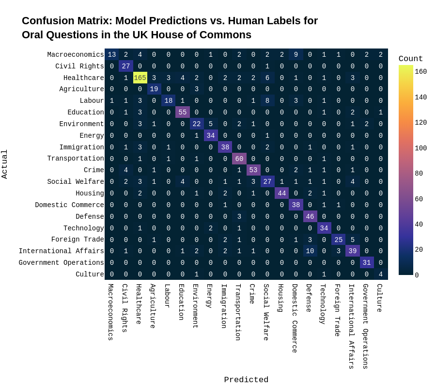


# Notebook 1 {.center}

**Open `code/bbc_news_cats.ipynb`**

Project 1: Fine-tuning BERT for Text Classification

<figure>
  
</figure>


---

# 🍽️ Lunch Break {.center}

*Back at 13:00*

---

# Project 2 {.center}

## Structured Data Extraction with a Large Model API


# Project 2: From Training to Prompting

- In Project 1 we *trained* a model — we needed labelled data and a GPU

- In Project 2 we *prompt* a model — we describe the task in plain language and send it to a remote API

- **Zero-shot prompting**: the model performs a task it has never been specifically trained on, using knowledge from pre-training
  - No labelled data required
  - Works immediately — just write good instructions

- **Why is this powerful for social scientists?**
  - Pilot studies and exploratory coding without annotation effort
  - Complex, multi-field extraction in a single call
  - Tasks that are hard to define with fixed labels in advance


# Prompt Engineering

- A **prompt** is the instruction we send to the model. Writing effective prompts is a skill.

- **System message**: persistent background instructions (who the model is, what format to use)

- **User message**: the specific input to process (e.g. the document to extract from)

- Key principles for structured extraction:
  - Define the **output schema** explicitly (field names, allowed values)
  - Use **JSON output** so results are machine-parseable
  - Specify edge cases and defaults
  - Test on a small sample before running at scale

```python
messages = [
  {"role": "system", "content": "You are an expert in UK legislation.
   Return a JSON object with fields: policy_area, affected_group,
   geographic_scope, bill_summary."},
  {"role": "user",   "content": "Bill title: Cycle Tracks Bill 1985/86"}
]
```


# Project 2: The Extraction Task

- **Dataset**: Successful UK House of Commons Private Members' Bills (1983–present)
  - 404 bills, each with a title like: *"Taxis and Private Hire Vehicles (Safeguarding and Road Safety) Bill 2021-22"*

- **Task**: Extract four structured fields from each bill title

  | Field | Example |
  |-------|---------|
  | `policy_area` | Transport |
  | `affected_group` | taxi drivers, passengers |
  | `geographic_scope` | UK-wide |
  | `bill_summary` | Requires safeguarding checks for taxi drivers |

- **Validation**: compare a sample of API extractions to hand-coded labels


# Notebook 2 {.center}

**Open `code/api_extraction.ipynb`**

Project 2: Structured Data Extraction with the OpenAI API

<figure>
  
</figure>


---

# ☕ Short Break {.center}

*Back in 10 minutes*

---

# Project 3 {.center}

## Analysing Images with a Vision Language Model


# Project 3: Vision Language Models

- **Multimodal LLMs** can process both text *and* images as input
  - GPT-4o, Claude, and Gemini all support image inputs
  - Images are encoded by a **vision encoder** into embeddings fused with text

- **What can they do with images?**
  - Describe image content in natural language
  - Answer factual questions about what is depicted
  - Count people, read visible text (OCR), identify objects and settings
  - Reason about context, relationships, and meaning

- **Two ways to send images**
  - **URL**: point to a publicly accessible image online
  - **Base64**: embed a local file directly in the API request


# Project 3: Visual Content Analysis in Social Science

Visual data is increasingly central to social science research — but has been hard to analyse at scale

- **Political protests**: who protests, how, where, with what demands?
- **Political advertising**: visual framing, emotional appeals, targeting
- **Social media imagery**: meme spread, visual discourse, disinformation
- **Archival photographs**: historical documentation, newspaper front pages
- **Parliamentary records**: chamber composition, seating, symbolic objects

Vision LLMs let us apply a **structured coding scheme** to images in the same way we prompt for text extraction in Project 2 — describe your categories in the system message, receive coded JSON output


# Project 3: Our Coding Scheme

We code eight dimensions of political protest photographs:

| Dimension | Example values |
|-----------|----------------|
| `setting` | outdoor public space, street march, parliament |
| `crowd_size` | individual, small group, large crowd |
| `visible_signage` | yes / no / unclear |
| `primary_theme` | environment, racial justice, gender rights, ... |
| `emotional_tone` | angry, hopeful, solemn, determined |
| `actors_visible` | protesters, police, politicians, media |
| `image_type` | march, rally, vigil, direct action |
| `confidence` | high / medium / low |

Adapted from the visual framing literature (Koenig 2006; Rodriguez & Dimitrova 2011)


# Notebook 3 {.center}

**Open `code/vision_analysis.ipynb`**

Project 3: Analysing Political Images with GPT-4o Vision

<figure>
  
</figure>


---

# Wrap-up & Broader Context {.center}


# My Research: LLMs in Practice {.center}

---

# Project: COVID-19 Policy Opposition in Congress

**Question**: Does personally contracting COVID-19 change how legislators publicly oppose containment policies?

- **Dataset**: All US congressional press releases & Twitter messages (2020–2021)
- **LLM task**: Fine-tune a language model to classify texts as *supporting* or *opposing* COVID-19 containment policies
  - Trained on 4,200 manually coded press releases across 20 issue categories
  - Scaled to classify all congressional communications over two years
- **Design**: Staggered difference-in-differences — legislators serve as their own controls before and after infection

::: footer
COVID-19 Policy Opposition in Congress
:::


## How much Opposition by Party Were Democrats and Republicans?


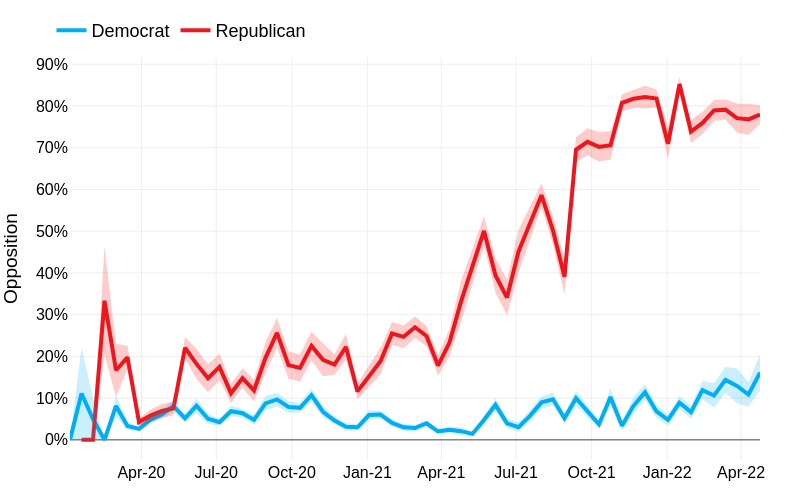{fig-align="center"}


## What Happened When Legislators Got COVID-19?


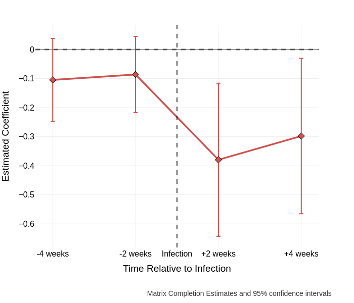{fig-align="center"}


Infection reduced expressed opposition to COVID-19 policies by ~30%, even in a highly polarised environment

::: footer
COVID-19 Policy Opposition in Congress
:::


## Model Validation

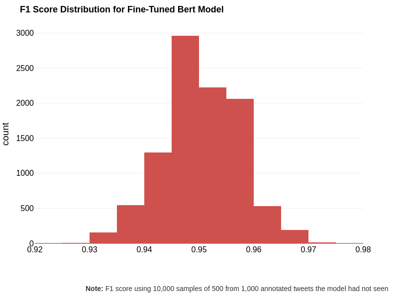{fig-align="center"}

Fine-tuned classifier achieves 95% accuracy on held-out test set.

::: footer
COVID-19 Policy Opposition in Congress
:::


---

# Project: Gender Gap in Legislative Responsiveness

**Question**: Do women legislators respond more dynamically to shifts in constituents' issue priorities?

- **Dataset**: ~400 bi-weekly YouGov surveys (2018–2022, US & UK) + 3 million legislator tweets
- **LLM task**: Fine-tune a language model to classify legislative tweets into policy issue domains
  - Trained on CAP-coded political texts across multiple issue areas
  - Applied to classify 3+ million tweets into issue categories matching the survey instrument
- **Design**: Vector autoregressions linking public issue salience to legislative attention over time

::: footer
Gender Gap in Legislative Responsiveness
:::


## Classifying 3 Million Legislative Tweets

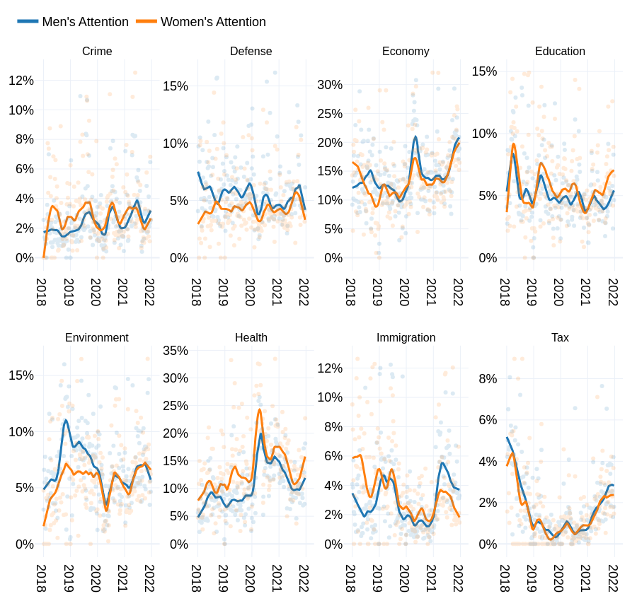{fig-align="center"}


## Public Opinion on the Same Issues

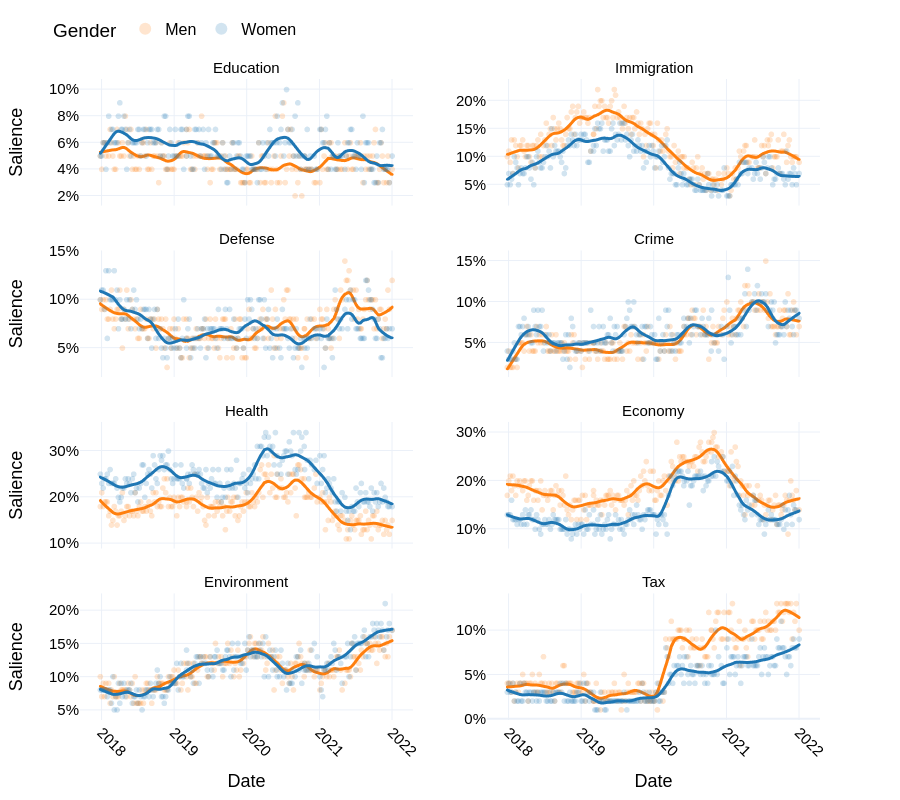{fig-align="center"}


# Women Legislators Are More Responsive

:::: {.columns}
::: {.column width="50%"}
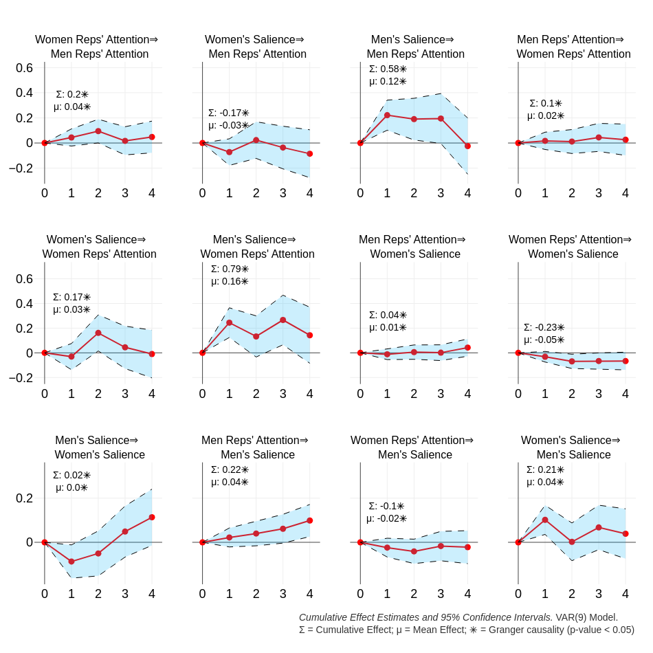
:::
::: {.column width="50%"}
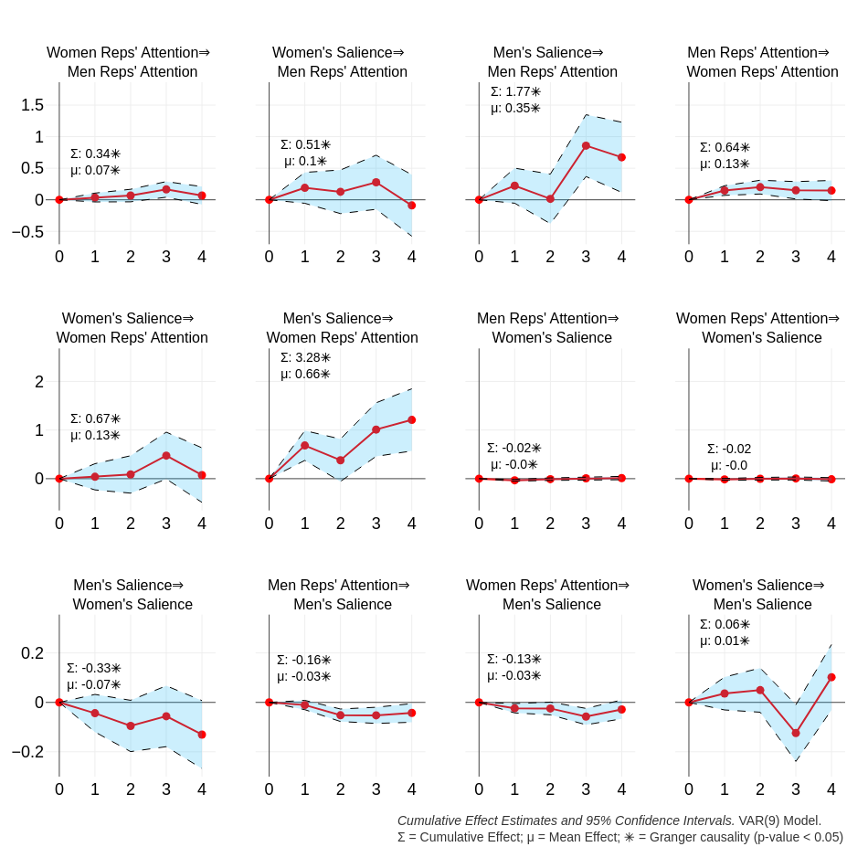
:::
::::

Women representatives show significantly greater responsiveness to shifts in public issue salience (US & UK)

::: footer
Gender Gap in Legislative Responsiveness
:::


# Validation: Classifying 3 Million Legislative Tweets

{fig-align="center"}

LLM classifier validated against hand-coded sample; high performance across issue categories

::: footer
Gender Gap in Legislative Responsiveness
:::


---

# Project: Climate Change as a Radical Right Wedge Issue

**Question**: Are radical right parties in Europe increasingly mobilizing climate change as a wedge issue?

- **Dataset**: Party press releases across 9 European countries (10+ years)
- **LLM task**: Fine-tune a *multilingual* BERT to classify press releases by policy area and climate position
  - Trained on 257,756 sentences from CAP-coded texts in multiple European languages
  - Classified 100,000+ press releases into policy topics and climate stances
- **Design**: Compare attention and positioning across party families over time

::: footer
Climate Change as a Radical Right Wedge Issue
:::

# A Multilingual Policy Classifier

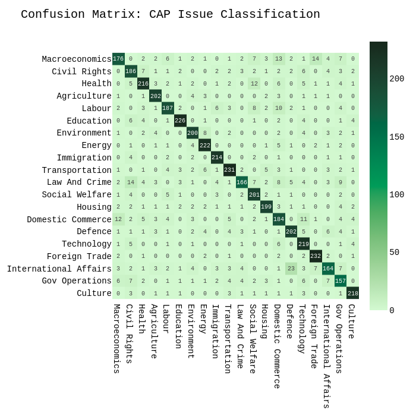{fig-align="center"}

Multilingual BERT fine-tuned on CAP-coded political texts; 90% accuracy on held-out press releases

::: footer
Climate Change as a Radical Right Wedge Issue
:::

# Radical Right Attention to Climate Change

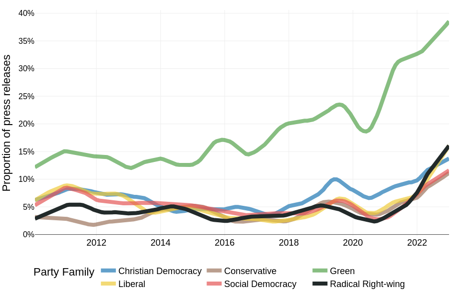{fig-align="center"}

Radical right parties show increasing attention to climate issues — but with distinctly adversarial positions

::: footer
Climate Change as a Radical Right Wedge Issue
:::

# Party Positions on Climate Change

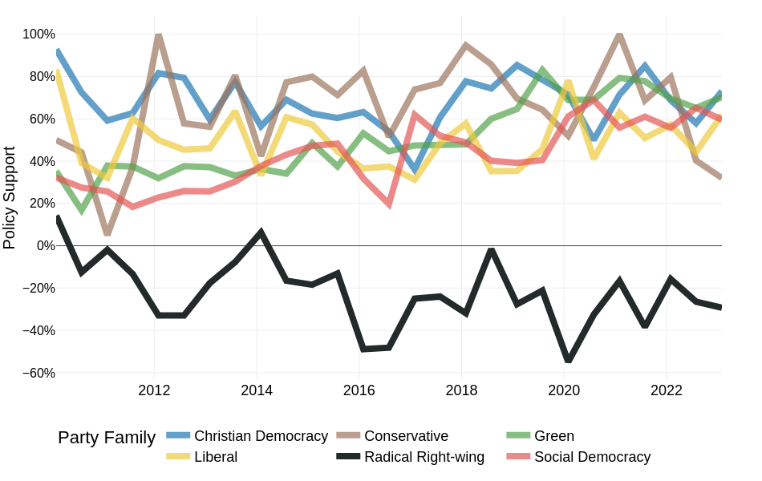{fig-align="center"}

LLM-classified press releases reveal radical right diverges sharply from mainstream parties on climate policy

::: footer
Climate Change as a Radical Right Wedge Issue
:::

---

# Advanced Applications in the Social Sciences

# Predicting Conflict Intensity

Introducing an Interpretable Deep Learning Approach to Domain-Specific Dictionary Creation: A Use Case for Conflict Prediction [Häffner et al. (2023)](https://doi.org/10.1017/pan.2023.7)


*We train the neural networks on a corpus of conflict reports and match them with conflict event data. This corpus consists of over 14,000 expert-written International Crisis Group (ICG) CrisisWatch reports between 2003 and 2021*


# Microtargeting and Political Persuasion


Evaluating the persuasive influence of political microtargeting with large language models [Hackenburg & Margetts (2024)](https://www.pnas.org/doi/abs/10.1073/pnas.2403116121)

*[...] we integrate user data into GPT-4 prompts in real-time, facilitating the live creation of messages tailored to persuade individual users on political issues. We then deploy this application at scale to test whether personalized, microtargeted messaging offers a persuasive advantage compared to nontargeted messaging.*


# Synthetic Data Generation

Synthetically generated text for supervised text analysis [Halterman (2025)](https://doi.org/10.1017/pan.2024.31)

*This article proposes using LLMs to generate synthetic training data for training smaller, traditional supervised text models.*


# Scaling Political Texts

Positioning Political Texts with Large Language Models by Asking and Averaging [Le Mens & Gallego (2025)](https://doi.org/10.1017/pan.2024.29)

*We ask an LLM where a tweet or a sentence of a political text stands on the focal dimension and take the average of the LLM responses to position political actors such as US Senators, or longer texts such as UK party manifestos or EU policy speeches given in 10 different languages.*


# Limitations & Ethical Considerations

<br>

**Not a panacea**


# Ethical Considerations in LLMs

- **Data Bias**
  - Models can learn biases present in the training data
  - Biases can be harmful and perpetuate stereotypes
- **Data Privacy**
  - Models can memorize sensitive information present in the training data
  - Do not send confidential or personally identifiable data to commercial APIs
- **Environmental Impact**
  - Training large language models requires a lot of computational resources
  - This can have a significant environmental impact
- **Dual-use**
  - Methods developed for research can be repurposed for surveillance, manipulation, or disinformation


# Limitations

- Synthetic survey data generation: [Bisbee et al. (2023)](https://osf.io/preprints/socarxiv/5ecfa), [Sanders et al. (2023)](https://arxiv.org/abs/2307.04781) and [Simmons & Hare (2023)](https://arxiv.org/abs/2310.17888)
  - A word of caution (see [Bisbee et al. (2023)](https://osf.io/preprints/socarxiv/5ecfa))


# Replication & Reproducibility

- Take replication seriously — impose standards on ourselves and others
- Opt for open-source models or pin versions of proprietary models
- Think carefully about reducing variance (e.g. adjust temperature, log your prompts)
- Always report: model name, model version, prompt text, date of analysis


# Future Directions

- **Agentic systems**
  - LLMs that plan, use tools, and complete multi-step tasks autonomously
  - Applications: automated literature review, data collection pipelines

- **Multimodal research** (beyond what we covered today)
  - Audio and video analysis (speeches, interviews, political advertising)
  - Cross-modal reasoning: image + caption + article together

- **Open-source models closing the gap**
  - LLaMA 3, Mistral, Qwen — run locally, no API costs, full reproducibility
  - Particularly important for sensitive or proprietary data

- **The measurement question**
  - As LLMs become standard tools, the field must develop shared standards for validity, reliability, and transparency in LLM-assisted measurement


# What questions can I answer?


# References


